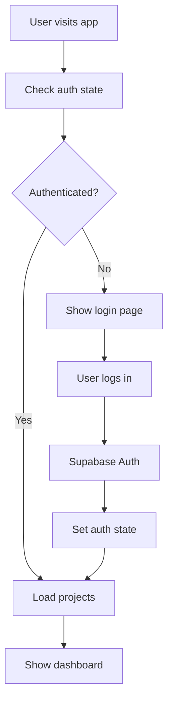
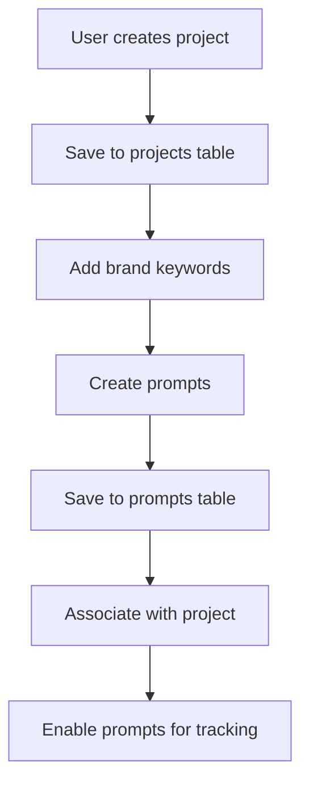
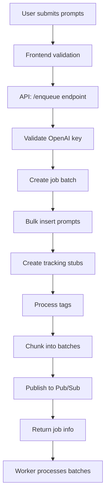
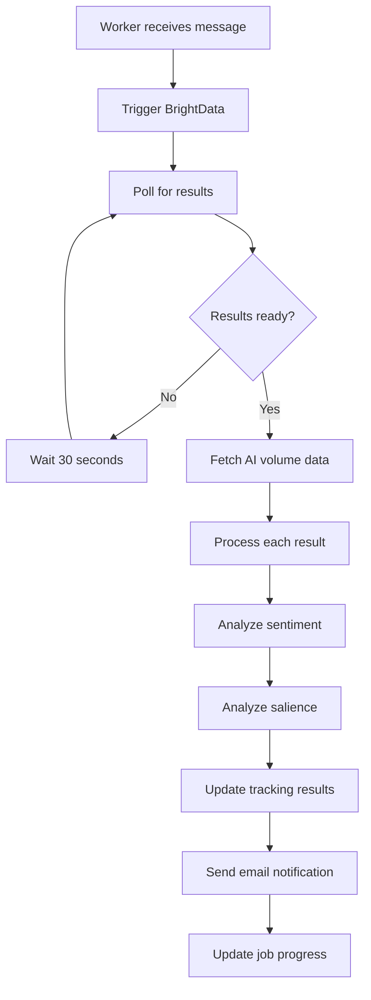
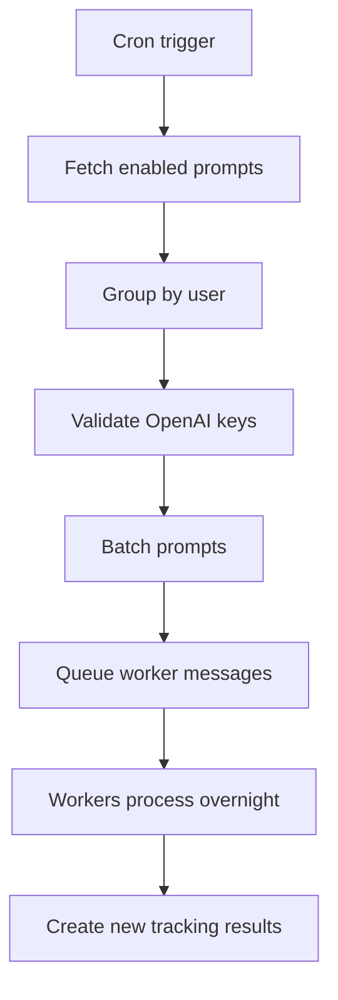

# ChatGPT Rank Tracker - Architecture & Application Flow Documentation

## Table of Contents
1. [System Overview](#system-overview)
2. [Architecture Components](#architecture-components)
3. [Database Schema](#database-schema)
4. [Application Flow](#application-flow)
5. [External Services Integration](#external-services-integration)
6. [Deployment Architecture](#deployment-architecture)
7. [Data Processing Pipeline](#data-processing-pipeline)
8. [Security & Authentication](#security--authentication)

---

## System Overview

ChatGPT Rank Tracker is a full-stack web application that monitors brand mentions and sentiment in ChatGPT responses. The system processes user-defined prompts through ChatGPT via BrightData's API, analyzes the responses for brand presence, sentiment, and salience using OpenAI's API, and provides detailed analytics through a React-based dashboard.

### High-Level Architecture
```
┌─────────────────┐    ┌─────────────────┐    ┌─────────────────┐
│   Frontend      │    │    Backend      │    │   External      │
│   (React/Vite)  │◄──►│   (Node.js)     │◄──►│   Services      │
│                 │    │                 │    │                 │
│ • React SPA     │    │ • Express API   │    │ • BrightData    │
│ • Zustand Store │    │ • Pub/Sub       │    │ • OpenAI API    │
│ • Supabase SDK  │    │ • Worker Queue  │    │ • DataForSEO    │
│ • TailwindCSS   │    │ • Cron Jobs     │    │ • Supabase DB   │
└─────────────────┘    └─────────────────┘    └─────────────────┘
```

---

## Architecture Components

### Frontend Architecture (React/TypeScript)

#### Core Technologies
- **Framework**: React 18 with TypeScript
- **Build Tool**: Vite
- **Styling**: TailwindCSS
- **State Management**: Zustand with persistence
- **Routing**: React Router v6
- **UI Components**: Headless UI, Lucide React icons
- **Data Visualization**: Recharts
- **Authentication**: Supabase Auth SDK

#### Component Structure
```
src/
├── components/
│   ├── auth/           # Authentication components
│   ├── projects/       # Project management
│   ├── results/        # Results display & analysis
│   ├── layouts/        # Page layouts (Protected/Public)
│   └── shared/         # Reusable components
├── store/
│   ├── authStore.ts    # Authentication state
│   ├── projectStore.ts # Project management state
│   └── trackingStore.ts# Results tracking state
├── services/
│   ├── rankingService.ts # BrightData integration
│   └── cmsService.ts   # Content management
└── lib/
    └── supabase/       # Database client & auth
```

#### State Management Pattern
- **Zustand stores** for global state management
- **Persistent storage** with localStorage fallback to sessionStorage (iOS Safari compatibility)
- **Real-time updates** via Supabase subscriptions

### Backend Architecture (Node.js)

#### Core Components
1. **API Server** (`server.js`)
   - Express.js REST API
   - Request validation and batching
   - Job queue management via Google Pub/Sub

2. **Worker Process** (`worker.js`)
   - Pub/Sub message consumer
   - BrightData API integration
   - OpenAI sentiment/salience analysis
   - Email notifications via Mailgun

3. **Nightly Refresh System** (`nightly.js`)
   - Cron-based automated refresh
   - Batch processing for all enabled prompts
   - Testing mode for development

4. **Configuration** (`config.js`)
   - Service clients initialization
   - Environment-based configuration

#### Message Queue Architecture
```
┌─────────────┐    ┌─────────────┐    ┌─────────────┐
│   Server    │    │  Pub/Sub    │    │   Worker    │
│             │───►│   Topic     │───►│   Process   │
│ • Validates │    │             │    │             │
│ • Batches   │    │ • Reliable  │    │ • Processes │
│ • Queues    │    │ • Scalable  │    │ • Analyzes  │
└─────────────┘    └─────────────┘    └─────────────┘
```

---

## Database Schema

### Core Tables

#### 1. **users** (Supabase Auth)
```sql
- id (uuid, primary key)
- email (text)
- created_at (timestamptz)
- updated_at (timestamptz)
```

#### 2. **projects**
```sql
- id (uuid, primary key)
- user_id (uuid, foreign key)
- name (text)
- description (text)
- created_at (timestamptz)
- updated_at (timestamptz)
```

#### 3. **prompts**
```sql
- id (uuid, primary key)
- text (text)
- enabled (boolean)
- project_id (uuid, foreign key)
- user_id (uuid, foreign key)
- source (text)
- user_city (text)
- user_country (text)
- brand_mentions (text[])
- domain_mentions (text[])
- created_at (timestamptz)
```

#### 4. **tracking_results**
```sql
- id (uuid, primary key)
- prompt_id (uuid, foreign key)
- prompt (text)
- project_id (uuid, foreign key)
- user_id (uuid, foreign key)
- job_batch_id (uuid, foreign key)
- batch_number (integer)
- snapshot_id (text)
- status (text) -- pending, fulfilled, failed
- timestamp (bigint)
- is_present (boolean)
- is_domain_present (boolean)
- sentiment (integer) -- 0-100 scale
- salience (integer) -- 0-100 scale
- response (text) -- JSON with full BrightData response
- brand_mentions (text[])
- domain_mentions (text[])
- brand_name (text)
- source (text)
- mention_count (integer)
- domain_mention_count (integer)
- ai_search_volume (integer) -- From DataForSEO
- ai_monthly_trends (jsonb) -- Monthly trend data
- ai_volume_fetched_at (timestamptz)
- ai_volume_location_code (integer)
```

#### 5. **job_batches**
```sql
- id (uuid, primary key)
- user_id (uuid, foreign key)
- project_id (uuid, foreign key)
- email (text)
- total_prompts (integer)
- total_batches (integer)
- completed_batches (integer)
- failed_batches (integer)
- status (text) -- pending, processing, completed, failed
- openai_key (text)
- openai_model (text)
- web_search (boolean)
- user_country (text)
- user_city (text)
- brand_mentions (text[])
- domain_mentions (text[])
- tags (text[])
- created_at (timestamptz)
- updated_at (timestamptz)
- completed_at (timestamptz)
- error_message (text)
```

#### 6. **tags** & **prompt_tags**
```sql
-- tags table
- id (uuid, primary key)
- name (text)
- color (text)
- project_id (uuid, foreign key)
- user_id (uuid, foreign key)
- created_at (timestamptz)

-- prompt_tags junction table
- prompt_id (uuid, foreign key)
- tag_id (uuid, foreign key)
- PRIMARY KEY (prompt_id, tag_id)
```

#### 7. **user_settings**
```sql
- user_id (uuid, primary key)
- openai_key (text)
- welcome_seen (boolean)
- created_at (timestamptz)
- updated_at (timestamptz)
```

### Row Level Security (RLS)
- **Enabled** on all tables
- **User-scoped policies** ensure data isolation
- **Service role access** for backend operations
- **Public read access** for tracking results (with user filtering)

---

## Application Flow

### 1. User Authentication Flow


### 2. Project & Prompt Management Flow


### 3. Analysis Request Flow (User-Initiated)


### 4. Worker Processing Flow


### 5. Nightly Refresh Flow


---

## External Services Integration

### 1. BrightData Integration
**Purpose**: ChatGPT response scraping
- **Trigger API**: Submits prompts to ChatGPT
- **Snapshot API**: Retrieves processed results
- **Rate Limiting**: Built-in retry logic with exponential backoff
- **Data Format**: Complete ChatGPT response with citations

**Flow**:
1. POST to trigger endpoint with prompts
2. Receive snapshot_id
3. Poll snapshot endpoint until results ready
4. Process response data

### 2. OpenAI Integration
**Purpose**: Sentiment and salience analysis
- **Model**: GPT-4 (configurable)
- **Sentiment Analysis**: 0-100 scale rating
- **Salience Analysis**: Brand prominence scoring
- **Rate Limiting**: Built-in retry with backoff
- **Validation**: Pre-flight API key validation

### 3. DataForSEO Integration
**Purpose**: AI search volume data
- **API**: AI Keyword Data endpoint
- **Processing**: Keyword extraction from prompts
- **Batching**: Efficient bulk processing
- **Data**: Monthly trends and current volume

### 4. Supabase Integration
**Purpose**: Database, authentication, real-time updates
- **Database**: PostgreSQL with RLS
- **Auth**: Email/password with session management
- **Real-time**: WebSocket subscriptions for live updates
- **Storage**: Persistent user sessions

### 5. Google Cloud Pub/Sub
**Purpose**: Asynchronous job processing
- **Reliability**: At-least-once delivery
- **Scalability**: Automatic scaling of workers
- **Retry Logic**: Built-in message retry
- **Dead Letter**: Failed message handling

### 6. Mailgun Integration
**Purpose**: Email notifications
- **Templates**: Custom email templates
- **Batch Notifications**: Per-batch completion emails
- **Failure Notifications**: Error handling emails
- **Unsubscribe**: Built-in unsubscribe handling

---

## Deployment Architecture

### Frontend Deployment (Netlify)
- **Build**: Vite production build
- **CDN**: Global edge distribution
- **Functions**: Serverless API proxies for BrightData
- **Environment**: Production/staging environment variables

### Backend Deployment (Google Cloud/VPS)
- **Process Manager**: PM2 for process management
- **Server**: Express.js API server
- **Worker**: Background Pub/Sub consumer
- **Nightly**: Cron-based scheduled jobs
- **Monitoring**: Process health monitoring

### Database (Supabase)
- **Hosting**: Managed PostgreSQL
- **Backups**: Automated daily backups
- **Scaling**: Automatic connection pooling
- **Security**: SSL connections, RLS policies

---

## Data Processing Pipeline

### 1. Data Ingestion
```
User Input → Validation → Database Storage → Queue Message
```

### 2. External Processing
```
BrightData Trigger → Response Polling → Data Retrieval
```

### 3. AI Analysis
```
Response Text → OpenAI Analysis → Sentiment/Salience Scores
```

### 4. Volume Enhancement
```
Prompt Keywords → DataForSEO API → Volume Trends
```

### 5. Result Storage
```
Processed Data → Database Update → User Notification
```

### 6. Real-time Updates
```
Database Change → Supabase Realtime → Frontend Update
```

---

## Security & Authentication

### Authentication Flow
1. **Supabase Auth**: Email/password authentication
2. **Session Management**: JWT tokens with refresh
3. **Persistent Sessions**: localStorage with fallbacks
4. **Route Protection**: Protected layout wrapper

### Data Security
1. **Row Level Security**: Database-level access control
2. **API Key Storage**: Encrypted user settings
3. **CORS Configuration**: Restricted origin access
4. **Input Validation**: Server-side request validation

### API Security
1. **Rate Limiting**: Built-in request throttling
2. **Authentication Headers**: Required for all requests
3. **Error Handling**: Secure error messages
4. **Logging**: Comprehensive audit trails

---

## Performance Optimizations

### Frontend
- **Code Splitting**: Route-based lazy loading
- **State Management**: Efficient Zustand stores
- **Caching**: Persistent state with localStorage
- **Bundle Optimization**: Vite tree-shaking

### Backend
- **Batching**: Efficient bulk processing
- **Connection Pooling**: Database connection management
- **Async Processing**: Non-blocking worker queues
- **Retry Logic**: Exponential backoff for external APIs

### Database
- **Indexing**: Optimized query performance
- **Bulk Operations**: Efficient data insertion
- **Connection Management**: Supabase connection pooling
- **Query Optimization**: Selective field retrieval

---

## Monitoring & Observability

### Application Monitoring
- **Process Health**: PM2 monitoring
- **Error Tracking**: Comprehensive error logging
- **Performance Metrics**: Response time tracking
- **Queue Monitoring**: Pub/Sub message processing

### Business Metrics
- **User Analytics**: Project and prompt usage
- **Processing Metrics**: Success/failure rates
- **Cost Tracking**: External API usage
- **Performance Benchmarks**: Processing time analysis

---

This documentation provides a comprehensive overview of the ChatGPT Rank Tracker architecture and application flow. The system is designed for scalability, reliability, and maintainability, with clear separation of concerns and robust error handling throughout the pipeline.
